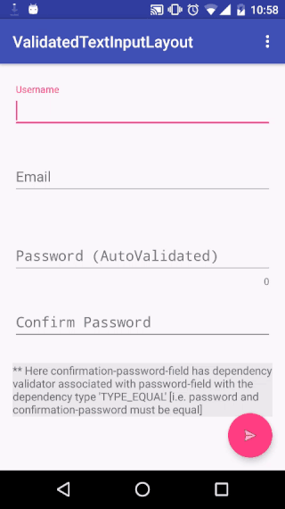

ValidatedTextInputLayout 
========================

>An extension to android design support library's TextInputLayout with validation support

## Demo ##

## Features ##
 - **AutoValidation**  
 Validate the input field as the text changes.  
    `mInput.autoValidate(true);`
    If `false` you need to call the `validate()` method explicitly for validation.  
    OR  
    use xml attribute `autoValidate` as true or false.
 
 - **AutoTrim**  
 `mInput.getValue()` will return the value of input field after removing leading and trailing 
 white spaces  
 
    `mInput.autoTrimValue(true);`  
    OR  
    use xml attribute `autoTrim` as true or false.
    
 - **Add Validators**  
 You can add multiple validators to a single input field.  
     `mInput.addValidator(/* Your first Validator class goes here */);`  
     `mInput.addValidator(/* Your second Validator class goes here */);`  
 
 - **Clear Validators**  
 Removes all the validators associated with the input field.  
    `mInput.clearValidators();`  
    
 - **Default Available Validators**  
    + **RequiredValidator**  
    Validates the input field as required. i.e. empty value is not valid.  
        `mInput.addValidator(new RequiredValidator("Your error message"));`  
        OR  
        use xml attribute `isRequired` as true or false.  
        The default message will be "This field is required."  
        For custom message you can use xml attribute `requiredValidationMessage`
        
    + **LengthValidator**  
    Validates the input field against minimum and maximum length specified.  
        `mInput.addValidator(new LengthValidator(8 /* Max Length */, "Your error message"));`  
        `mInput.addValidator(new LengthValidator(4 /* Min Length */, *8 /* Max Length */, "Your error message"));`  
         OR  
         use xml attributes `minLength` and `maxLength` with default values being "zero" and "indefinite" respectively.  
         The default message will be one of following
         - The input must have length between "minLength" and "maxLength".
         - The input length must be greater than or equal to "minLength".
         - The input length must be less than or equal to "maxLength".  
         based on your values for `minLength` and `maxLength` attributes.  
         For custom message you can use xml attribute `lengthValidationMessage`
    + **RegexValidator**  
        Validates the input field against provided regular expression. Equivalent to `String.matches()`  
            `mInput.addValidator(new RegexValidator("your_regex", "Your error message"));`  
            OR  
            use xml attribute `regex` to set your regular expression.  
            The default message will be "The field value does not match the required format."  
            For custom message you can use xml attribute `regexValidationMessage`
    + **DependencyValidator**  
            Validates the input field as per the dependency type with the input field it depends 
            on.  
            If `mInput1` depends on `mInput2` with dependency type TYPE_EQUAL: (i.e. `mInput1
            .getValue()` must be equal to `mInput1.getValue()`)  
            `mInput1.addValidator(new DependencyValidator(mInput2, TYPE_EQUAL,  "Your error 
            message"));`
 
 - **Custom Validators**  
 You can create your own validators to use with ValidatedTextInputLayout just by extending the `BaseValidator` class.  
 You need to call the `super()` method with the desired message and override `isValid()` method to return true or false;    
 
 Example: Validator class to check if field value contains  character sequence "xyz"  
  
        public class MyValidator extends BaseValidator {
            public MyValidator(String pErrorMessage){
                super(pErrorMessage);
            }
            
            @Override
            public boolean isValid(String pText){
                return pText.contains("xyz");
            }
        }

## Usage ##
 - **Maven**
 
        <dependency>
              <groupId>com.julianraj</groupId>
              <artifactId>validatedtextinputlayout</artifactId>
              <version>0.0.4</version>
              <type>pom</type>
        </dependency>
 
 - **Gradle**
 
        compile 'com.julianraj:validatedtextinputlayout:0.0.4'

 - You can use and style it similar to **Android Design Library's** _TextInputLayout_  
 
        <com.julianraj.validatedtextinputlayout.ValidatedTextInputLayout
                android:id="@+id/username"
                android:layout_width="match_parent"
                android:layout_height="wrap_content"
                validation:autoTrim="true"
                validation:isRequired="true"
                validation:requiredValidationMessage="Your error message here.">
        
                <android.support.design.widget.TextInputEditText
                    android:layout_width="match_parent"
                    android:layout_height="wrap_content"
                    android:hint="Username"
                    android:singleLine="true"/>
        
        </com.julianraj.validatedtextinputlayout.ValidatedTextInputLayout>
        
        <com.julianraj.validatedtextinputlayout.ValidatedTextInputLayout
                android:id="@+id/password"
                android:layout_width="match_parent"
                android:layout_height="wrap_content"
                validation:autoValidate="true"
                validation:lengthValidationMessage="Your error message here."
                validation:maxLength="8"
                validation:minLength="4">
        
                <android.support.design.widget.TextInputEditText
                    android:layout_width="match_parent"
                    android:layout_height="wrap_content"
                    android:hint="Password (AutoValidated)"
                    android:inputType="textPassword"
                    android:singleLine="true"/>
        
        </com.julianraj.validatedtextinputlayout.ValidatedTextInputLayout>
        
        <com.julianraj.validatedtextinputlayout.ValidatedTextInputLayout
                android:id="@+id/email"
                android:layout_width="match_parent"
                android:layout_height="wrap_content"
                validation:autoTrim="true"
                validation:regex="^[a-z0-9._%+-]+@(?:[a-z0-9-]+[.])+[a-z]{2,}$"
                validation:regexValidationMessage="Your error message here">
        
                <android.support.design.widget.TextInputEditText
                    android:layout_width="match_parent"
                    android:layout_height="wrap_content"
                    android:hint="Email"
                    android:singleLine="true"/>
        </com.julianraj.validatedtextinputlayout.ValidatedTextInputLayout>
        
License
-------

    Copyright 2016 Julian Raj Manandhar

    Licensed under the Apache License, Version 2.0 (the "License");
    you may not use this file except in compliance with the License.
    You may obtain a copy of the License at

       http://www.apache.org/licenses/LICENSE-2.0

    Unless required by applicable law or agreed to in writing, software
    distributed under the License is distributed on an "AS IS" BASIS,
    WITHOUT WARRANTIES OR CONDITIONS OF ANY KIND, either express or implied.
    See the License for the specific language governing permissions and
    limitations under the License.  